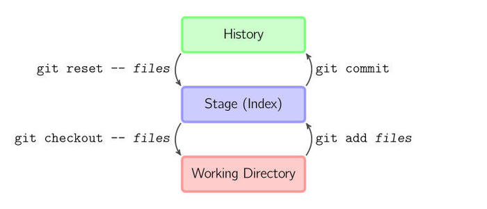

## 前言

阅读本篇文章需要读者了解 Git 的基本用法，如果你对 Git 完全不了解，请先行移步了解 Git 基础。
下面是几份本人觉得不错的 Git 入门教程，新手可以参考。
- [Git权威指南](http://www.worldhello.net/gotgit/index.html) | 国内一位大牛写的介绍 Git 用法的开源书籍，很详实
- [Pro Git](https://git-scm.com/book/zh/v2) | Git 官方社区编著的介绍 Git 用法的书籍

#### 创建新分支，并且切换到新分支
```bash
> git checkout -b <new_branch_name> # 根据当前所在分支，创建新分支
> git checkout -b <new_branch_name> <remote_name>/<remote_branch_name> # 根据远程分支，创建分支
```
#### 切换分支

`> git checkout <branch_name>`

#### 删除分支（本地/远程）

```bash
> git branch -d <branch_name> # 删除本地分支，当该分支没有关联远程分支或者关联的远程分支已经合并过，才会被允许删除
> git branch -D <branch_name> # 强制删除本地分支
> git push <remote_name> -d <branch_name> # 删除远程分支，git v1.7.0（2010年的版本）之后支持
> git push <remote_name> :<branch_name> # 删除远程分支，旧方式，新的也兼容这种

```

分支重命名

```bash
> git branch (-m | -M) [<oldbranch>] <newbranch> # 重命名分支语法，-M 强制重命名，具体参见 git branch --help
> git branch -m <newbranch> # 重命名当前分支
> git branch -m <oldbranch> <newbranch> # 重命名指定分支

```

重写 commit 信息

```bash
> git rebase -i HEAD~<num> # 交互式地重写 commit 信息，将会用终端默认的编辑器进行操作

下面的例子中，保存之后，将会使得[328f67b Update Rust]这一条合并到[f55b189 Update cookbook]

pick 164bf1c Update cookbook
pick f55b189 Update cookbook
f 328f67b Update Rust
pick 9834843 Update cookbook

# Rebase 0b6762c..9834843 onto 0b6762c (4 commands)
#
# Commands:
# p, pick = use commit
# r, reword = use commit, but edit the commit message
# e, edit = use commit, but stop for amending
# s, squash = use commit, but meld into previous commit
# f, fixup = like "squash", but discard this commit's log message
# x, exec = run command (the rest of the line) using shell
# d, drop = remove commit
#
# These lines can be re-ordered; they are executed from top to bottom.
#
# If you remove a line here THAT COMMIT WILL BE LOST.
#
# However, if you remove everything, the rebase will be aborted.
#
# Note that empty commits are commented out

```

> 注意：最好不要重写公共的 commit 信息，这会给协作者带来不必要的困惑，推荐仅仅重写本地没有提交的 commit 信息。假设，你非得重写远程 commit 信息，请使用 git push -f 来强制更新远程代码。

#### 从一个分支摘取 commit 到另一个分支

```bash
> git checkout <target-branch> # 切换到目标分支
> git cherry-pick <commit_id> # 将源分支的 commit 摘取到目的分支中
```

#### 想要切换分支时，发现本地有一些写了一半的代码

```bash
> git stash # 将当前工作目录内容储藏
> git stash --include-untracked # 如果新添加了文件，将其一并储藏
> git stash pop # 将储藏的内容恢复到当前分支
```

#### 回版、撤销commit

```bash
> git reset --hard <commit_id> # 彻底回退到指定 commit
```

 

#### 丢弃本地新添加的文件

`> git clean `

#### 丢弃新的改动

`> git checkout . # 注意末尾有个句号`

## 参考资料

- [Git权威指南](http://www.worldhello.net/gotgit/index.html) 

- [Pro Git](https://git-scm.com/book/zh/v2)

- Git cheatsheet

- 图解Git

  

转载：本文非原创转载[简书](https://www.jianshu.com/p/15e3a4873d1d)