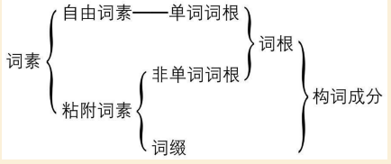
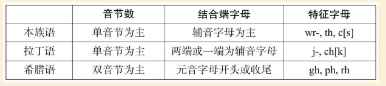
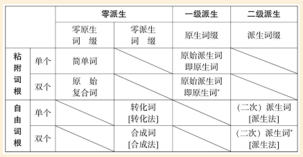

# 第一部分 英语词根的基本知识

“学习一门语言的最短最佳的途径，是掌握它的词根（Root）”

“词根是打开词汇宝库的第一把钥匙（Your First Key to Word Power）”

## 一、什么是词根

词素（Morpheme）则是最低一级具有区别性的语法单位。也就是说，词素是最小的音义结合的单位。词素按其独立性可分为两种：可单独作为词使用的叫自由词素（Free Morpheme），不能单独使用的，即必须与其他词素结合成单词才能使用的，就叫粘附词素或者粘着词素（Bound Morpheme）

词根有两种：一种是节本单词充当词根，属于自有词素，成为自由词根（Free Root），如friend，white，wash等；一种是非单词词根，属于粘附词素，称为粘附词根（Bound Root），如vis，manu，lect等。

定义：
词根是构词的基本词素，它与词缀相对，并带有主要的词汇信息。词根分为两种，能独立构词的是自有词根，必须与其他词素结合构词的是粘附词根。

## 二、英语词汇中的词根

英语经理了古英语、中古英语和现代英语三个发展阶段。

日耳曼语源（即本族词源）33%

拉丁与希腊语源（即古典语源）56%

凯尔特语源 2%

混合语源 3%

东方、非洲、美洲等语源 6%

1）本族词语大部分表示基本事物、基本概念与基本关系的使用率很高的单词，（yes,many,lady,woman,hand,day,year,world,over,road）2)本族语的词根多是能独立使用的自有词根。词根的形式等于改单词在词典中的词目形式，词根的含义等于该单词的基本含义。
state,estblish,constitution.............st(站)
union,united................................un(一)
order,ordain................................ord(次序)
insure,secure...........................cur(关心)
form.........................................form
perfect......................................fect
domestic..................................dom
provide.....................................vid
common...................................mun
defense...................................fens
promote..................................mot
general...................................gen
liberty.....................................liber
people...................................popul
justice.....................................jus
posterity................................post
tranquility...............................tranquil
古典语词根数量有限

​		自由词素----单词词根
							词根   
词素
				非单词词根				构词成分
		粘附词素
				词缀

## 四、从词根看词缀

根据词根性质把构词词缀分为两种：

能与自有词根结合的是派生词缀， 只能与粘附词根结合的是原始词缀。重点。
英语词缀可分为派生词缀与原生词缀：派生词缀能与自有词根及单词结合，原生词缀只能与粘附词根结合。由于原生词缀只存留在数以万计的古典语借词中，尚不为一般读者所掌握，所以是词缀学习的重点。

词缀是加在词基（单词或词根）上以构成新词干或为词干提供屈折成分的一种粘附词素。根据它与词基的相对位置不同，词缀可分为前缀、后缀与中缀；根据它对词基的影响不同，词缀分为构词词缀与屈折词缀。

词缀的定义明确了，词缀法的定义也迎刃而解了：词缀法就是在词基（单词或词根）上添加构词词缀从而生成新词干的方法。

定义明确之后便成为判断词缀的准绳：凡是符合词缀定义的构词成分都是词缀词素；凡由词缀法产生的词干都算缀合词或派生词。

这就是我们研究这三种定义的目的。

## 五、从词素角度反思英语构词法

按照词根是否加缀以及在何种词根上加缀，可将派生法分为三     级：

词根不加缀的“零级派生”可以产生简单词、原始复合词、转化词和合成词；
词根 加 原生 词缀 的“ 一级 派生” 产生 原始 派生词（ 或 原 生词）； 
自由词根或单词加派生词缀的“ 二级 派生” 产生二次派生词， 即传统 意义上 的 派生词。 
三级派生法大大开拓了英语构词法的领域， 使绝大部分英语单词都变得可分析、可解释。

## 八、 义：词根的含义与派生次的词义

在 分析 派生词 词形 的 基础上， 探求 派生词 的 词义。中

一级派生词

屈折词缀

